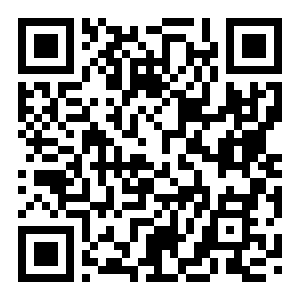

# Customized MSK Workshop

This is based on the [public MSK immersion day workshop](https://catalog.us-east-1.prod.workshops.aws/workshops/c2b72b6f-666b-4596-b8bc-bafa5dcca741/en-US/overview)

# Content

1. [MSK Workshop Preparation](pre-introduction.md) (15 mins)

2. [MSK operations labs](./msk-operations.md) (60 mins)  
    
3. MSK monitoring (25 mins)
    1. MSK monitoring introduction (presentation 10 mins)    
    2. Monitoring with Amazon CloudWath lab [[Link to MSK workshop]](https://catalog.us-east-1.prod.workshops.aws/workshops/c2b72b6f-666b-4596-b8bc-bafa5dcca741/en-US/cloudwatchmonitoring/overview) (10 mins)    
    3. Introduction of Monitoring with Prometheus and Grafana (5 mins)   

4. MSK Security and encryption (60 mins)
    1. Introduction of Security and Encryption with Amazon MSK (presentation 15 mins)
    2. [MSK security and encryption lab](./security-encription.md)

5. [MSK application - clickstream lab](./clickstreeam-lab.md) (45 mins)

6. Open discussion (15 mins)

## Please take a quick survey

